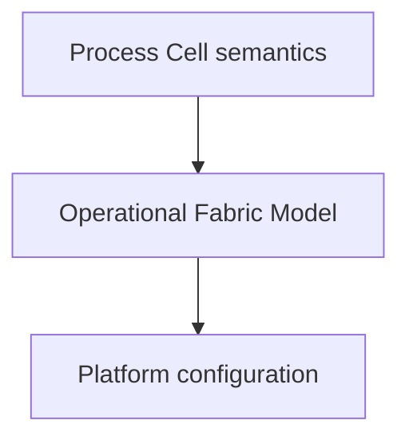
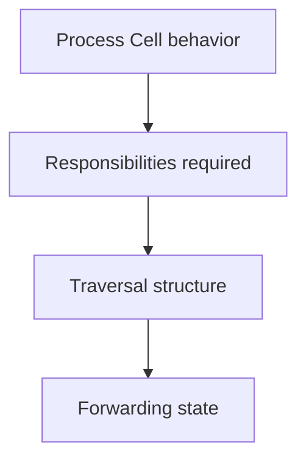
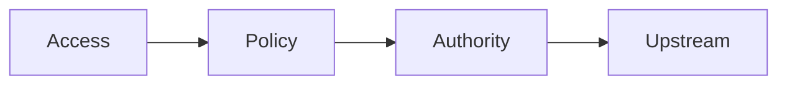

# nixos-fabric-solver — Theory

`nixos-fabric-solver` turns a compiled network **Process Cell** into a deterministic operational fabric.

The compiler defines **what communication must be possible**.  
The solver determines **how a network must operate so that communication becomes executable**.

The solver does not generate vendor configuration.  
It produces a stable execution model that renderers may later translate to platforms.

The output is therefore:

> a platform-independent operational description of a Site

* * *

## Position in the architecture

The project splits network definition into three layers:

| Layer | Responsibility |
| --- | --- |
| Compiler | defines communication semantics |
| Solver | constructs executable network behavior |
| Renderer | expresses behavior on a platform |

The solver is the boundary where intent becomes execution.

* * *

## ISA-88 interpretation

The project follows ISA-88 responsibility separation.

| ISA-88 Layer | Meaning here |
| --- | --- |
| Enterprise | administrative grouping |
| Site | authority boundary |
| Process Cell | allowed communication behavior |
| Unit | execution context capable of forwarding or enforcing |
| Equipment Module | responsibility performed by a Unit |
| Control Module | mechanism implementing the responsibility |

The compiler stops at Process Cell behavior.  
The solver realizes behavior into executable responsibilities.

* * *

## What the solver actually produces

The solver outputs a **Routed Operational Model**.

This model is not device configuration.  
It is the minimum deterministic state required for packet forwarding to exist.

The model contains:

| Category | Description |
| --- | --- |
| Responsibilities | which Units must perform which roles |
| Traversal ordering | how traffic must pass through Units |
| Ownership | which Unit controls routing decisions |
| Forwarding structure | next-hop relationships |
| Operational addressing | deterministic link identities |
| Enforcement placement | where policy must attach |

* * *

## Realization process

The solver progresses from abstract behavior to executable structure.

Each step removes ambiguity while preserving meaning.

* * *

## Responsibilities realized

From the behavioral contract, the solver derives operational roles.

Typical responsibilities:

| Responsibility | Purpose |
| --- | --- |
| access gateway | terminates owned address domains |
| policy engine | enforces communication permissions |
| authority rib | owns routing decisions |
| upstream selector | provides external reachability |
| transit forwarder | carries traffic between responsibilities |

A Unit may host multiple responsibilities.

* * *

## Traversal structure

The solver determines how traffic must traverse Units so the behavioral contract can be enforced.

This produces an execution ordering — not cabling, not topology — but a required path for packets.

This ordering guarantees:

* enforcement happens before exit
    
* routing authority remains consistent
    
* external reachability is reachable
    
* forbidden paths cannot exist
    

* * *

## Connectivity meaning

Connectivity in the solver is **execution adjacency**.

It does not represent switches, cables, or hardware.

It represents:

> which execution contexts must be able to exchange packets for behavior to exist

Therefore the solver builds a forwarding structure, not a physical topology.

* * *

## Deterministic network state

To make forwarding real, the solver allocates stable operational state:

| Element | Purpose |
| --- | --- |
| link identities | deterministic neighbor relationships |
| next-hop structure | packet traversal direction |
| routing ownership | authority boundaries |
| operational addresses | consistent forwarding references |

The allocation is reproducible across evaluations.

* * *

## Enforcement placement

Policy is not evaluated globally.

The solver determines **where enforcement must exist** so the behavior holds.

This ensures:

* policy cannot be bypassed
    
* routing authority cannot be skipped
    
* external reachability respects rules
    

* * *

## Operational fabric model

The final solved model describes how the Site behaves at runtime.

It contains:

* Units
    
* their responsibilities
    
* traversal relationships
    
* routing ownership
    
* forwarding structure
    

The model is platform-neutral and renderer-agnostic.

* * *

## Guarantees

For a given input, the solver always produces the same fabric.

The resulting network model:

* executes the defined communication behavior
    
* preserves authority boundaries
    
* prevents undefined traversal paths
    
* remains platform independent
    

* * *

# Practical usage

## 1) Compile semantics (compiler repository)

Codenix run path:../nixos-network-compiler#compile examples/single-wan/inputs.nix > ir.json

This produces the behavioral Site contract.

* * *

## 2) Evaluate the operational fabric

The solver is evaluated as a Nix function.

Codenix eval --json '  
let  
  ir = builtins.fromJSON (builtins.readFile ./ir.json);  
  solver = import ./.;  
in  
  solver { input = ir; }  
' > solved.json

* * *

## 3) Inspect runtime state

Example: inspect a Unit execution view

Codenix eval --json '  
let  
  ir = builtins.fromJSON (builtins.readFile ./ir.json);  
  solved = (import ./. { input = ir; });  
in  
  solved.query.node-context { nodeName = "s-router-policy-only"; }  
' | jq

You can inspect:

* forwarding behavior
    
* routing decisions
    
* upstream handling
    
* enforcement placement
    

* * *

## Platform usage

Renderers consume the solved model and translate it into configuration.

Typical targets:

* NixOS modules
    
* router configuration generators
    
* lab simulation backends
    

The solver itself remains platform neutral.

* * *

## Architectural direction

Future stages may materialize additional artifacts (planning layers), but they must always be derivable from the same operational model.

The invariant remains:

> behavior defines execution — execution defines configuration

